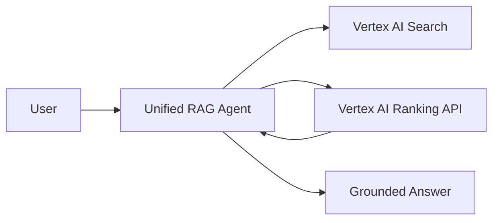
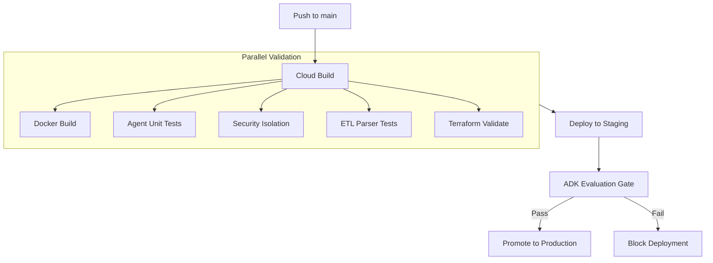

# JIT Two-Stage Retrieval Agentic RAG

A high-performance, production-grade Agentic RAG solution on Google Cloud Platform, featuring a two-stage retrieval architecture with built-in RBAC and automated evaluation.

## 🚀 Key Features



- **Two-Stage Retrieval**: Stage 1 (Fast Retrieval via Vertex AI Search) + Stage 2 (Deep Reasoning & Reranking via ADK Agent).
- **Identity-Aware Proxy (IAP)**: Zero-trust authentication out-of-the-box.
- **RBAC-Aware Filtering**: Security tags are injected at the retrieval layer to ensure data isolation.
- **Multi-Environment CI/CD**: Fully automated deployment to `stage` and `prod` GCP folders via Google Cloud Build.
- **Data Engine**: Automated ETL pipeline for GCS-to-Vertex AI Search ingestion with metadata enrichment.

## 📁 Repository Structure
```text
├── app/                # ADK Agent (Stage 2 logic)
├── frontend/           # React Chat UI
├── data-pipeline/      # ETL & Ingestion (Python)
├── infrastructure/     # Terraform IaC (Stage & Prod)
├── cicd/               # Deployment Pipeline (Cloud Build)
├── eval/               # ADK Evaluation Sets
├── scripts/            # Bootstrap & Utility scripts
└── docs/               # Technical use cases & documentation
```

## 🚀 CI/CD & Evaluation Gate

This project implements a high-velocity deployment pipeline using **Google Cloud Build**, utilizing parallel execution to minimize "Commit-to-Staging" latency while maintaining strict security and quality gates.



### Pipeline Tiers
1.  **Parallel Validation (Fast-Fail)**:
    *   **Docker Build**: Containers are built and pushed to Artifact Registry.
    *   **Agent Unit Tests**: Python tests for `roles.py`, `retriever.py`, and FastAPI endpoints.
    *   **Ingestion Parser Tests**: Validation of RBAC metadata extraction logic.
    *   **Infrastructure Check**: Terraform `validate` and `fmt` checks.
2.  **Staging Deployment**: Automated deployment to the Staging Cloud Run environment.
3.  **Evaluation Gate (ADK Eval)**: Automated quality check measuring Recall and Grounding Score against the golden set.
4.  **Production Promotion**: Image tagging and deployment to the Production environment only after all gates pass.

## 🛠️ Quick Start

### 1. Bootstrap the Environment
Before running Terraform, initialize each GCP project:
```bash
./scripts/bootstrap/bootstrap.sh <PROJECT_ID> [REGION]
```

### 2. Local Development Setup
Quickly spin up the backend and frontend for local testing:
```bash
# Setup dependencies and proxy
./scripts/local-dev/setup_local.sh

# Follow the instructions in scripts/local-dev/README.md to start the services
```

### 3. Accessing the Environments (Staging/Prod)
Since this project uses custom domains (`rag-stage.example.com`) and Identity-Aware Proxy (IAP), follow these steps to access the web UI:

#### **Staging DNS Workaround**
If you haven't mapped a real domain, you must point your local `hosts` file to the Load Balancer IP:
1.  **Get the IP**: Run `terraform output load_balancer_ip` in `infrastructure/environments/stage`.
2.  **Edit Hosts**: Add the following to `/etc/hosts` (Mac/Linux) or `C:\Windows\System32\drivers\etc\hosts` (Windows):
    ```text
    <LB_IP_ADDRESS> rag-stage.example.com
    ```
3.  **Bypass SSL Warning**: Navigate to `https://rag-stage.example.com`. Since we use a self-signed certificate fallback for staging, click **Advanced** -> **Proceed (unsafe)**.

### 4. Provision Infrastructure
Deploy the staging environment:
```bash
cd infrastructure/environments/stage
terraform init
terraform apply
```

### 5. Unified Commands
Use the `Makefile` in the root for common development tasks:
- `make install`: Install dependencies.
- `make playground`: Start the interactive ADK chat.
- `make test`: Run all unit and integration tests.
- `make eval`: Run AI quality evaluations.
- `make deploy-stage`: Trigger the staging deployment pipeline.

## 📖 Documentation
- [Technical Design Specification](docs/DESIGN_SPEC.md)
- [Infrastructure Guide](infrastructure/README.md)
- [Bootstrap Guide](scripts/README.md)
- [Industry Use Cases](docs/industry_use_cases_rag.md)
