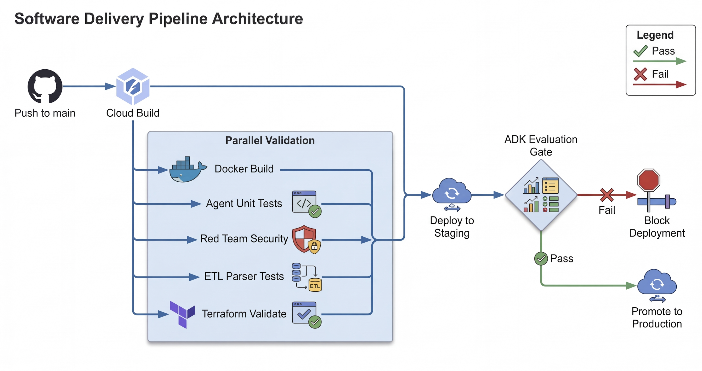

# JIT Two-Stage Retrieval Agentic RAG

A high-performance, production-grade Agentic RAG solution on Google Cloud Platform, featuring a **two-stage retrieval architecture** with built-in RBAC, automated ETL, and integrated evaluation.

---

## 🏗️ Architecture Overview

This project implements a two-stage retrieval pattern that balances high-speed discovery with deep semantic reasoning.


### Key Technical Pillars
1.  **Unified RAG Agent**: A single high-performance agent (built with ADK) that orchestrates retrieval and semantic reranking in a single turn for maximum grounding accuracy.
2.  **Two-Stage Workflow**: 
    *   **Stage 1 (Retrieval)**: Fast, scalable search via Vertex AI Search (Discovery Engine).
    *   **Stage 2 (Reranking)**: Deep reasoning via the Vertex AI Ranking API, using semantic cross-encoders to ensure the top-K snippets are contextually perfect.
3.  **Zero-Trust RBAC**: Identity is verified via **Identity-Aware Proxy (IAP)**. Security tags are dynamically injected at the retrieval layer based on the user's email, ensuring they only see documents they are authorized to access.
4.  **Data Engine**: A fully automated pipeline for document ingestion, parsing, and metadata enrichment.

---

## 🛠️ Data Engine (ETL Pipeline)

The ingestion pipeline ensures that every document uploaded to GCS is parsed, enriched with RBAC metadata, and indexed securely.


-   **Automated Triggers**: Eventarc reacts to GCS uploads in real-time.
-   **Intelligent Parsing**: Extracts text from PDFs and Markdown while preserving structure.
-   **RBAC Mapping**: Automatically assigns security roles (e.g., `finance`, `legal`) based on the GCS folder structure.

---

## 🔄 Continuous Improvement (Feedback Loop)

Every interaction is tracked to improve model performance and retrieval accuracy over time.


-   **User Sentiment**: Direct 👍/👎 feedback is streamed to BigQuery.
-   **Conversation Tracing**: Full prompt-response pairs are logged for auditability and RAG fine-tuning.

---

## 📊 Monitoring & Observability

The system includes a pre-configured **Cloud Monitoring Dashboard** to track system health, performance, and reliability in real-time.

### Key Metrics Tracked
- **Request Volume**: Total traffic hitting the RAG Agent and UI.
- **Latency (p95)**: End-to-end response times for grounding turns.
- **Error Rates**: Real-time tracking of 4xx and 5xx response codes.
- **Feedback Ingestion**: Verification of user sentiment data streaming into BigQuery.

### How to Access
1.  Navigate to the [**Cloud Monitoring Dashboards**](https://console.cloud.google.com/monitoring/dashboards) in the GCP Console.
2.  Search for **`JIT RAG System Health (stage/prod)`**.

---

## 📁 Repository Structure
```text
├── app/                # unified RAG Agent (FastAPI + ADK)
├── frontend/           # React Chat UI (Vite + Tailwind fallback)
├── data-pipeline/      # ETL & Ingestion (Python Cloud Functions)
├── knowledge-base/     # Golden Dataset and sample docs
├── infrastructure/     # Terraform IaC (Modular Stage/Prod)
├── cicd/               # Deployment Pipeline (Cloud Build)
├── eval/               # ADK Evaluation sets and configs
├── scripts/            # Bootstrap, DR, and Security scripts
└── docs/               # Technical specs and ADRs
```

---

## 🚀 CI/CD & Evaluation Gate

We use **Google Cloud Build** to implement a "Fast-Fail" pipeline with strict quality gates.



---

## 🛠️ Quick Start

### 1. Bootstrap the Environment
Initialize APIs and IAM for your GCP project:
```bash
./scripts/bootstrap/bootstrap.sh <PROJECT_ID> [REGION]
```

### 2. Local Development
Spin up the backend and frontend for local testing:
```bash
./scripts/local-dev/setup_local.sh
# Follow the instructions in scripts/local-dev/README.md
```

### 3. Provision Infrastructure
Deploy the staging environment:
```bash
cd infrastructure/environments/stage
terraform init
terraform apply
```

### 4. Unified Commands (Makefile)
- `make install`: Install all dependencies.
- `make playground`: Start the interactive ADK chat.
- `make test`: Run all unit and security tests.
- `make eval`: Run AI quality evaluations against the golden set.
- `make deploy-stage`: Trigger the staging deployment pipeline.

---

## 📖 Detailed Documentation
- [**Technical Design Spec**](docs/DESIGN_SPEC.md): Deep dive into architecture.
- [**API Versioning**](docs/API_VERSIONING_STRATEGY.md): Path-based versioning strategy.
- [**Model Provider ADR**](docs/ADR_MODEL_PROVIDER_FLEXIBILITY.md): AI Studio vs Vertex AI.
- [**Monitoring & Observability**](docs/MONITORING_AND_OBSERVABILITY.md): System health and metrics.
- [**Industry Use Cases**](docs/industry_use_cases_rag.md): Real-world application scenarios.
- [**Contributing Guide**](CONTRIBUTING.md): How to get started as a developer.
