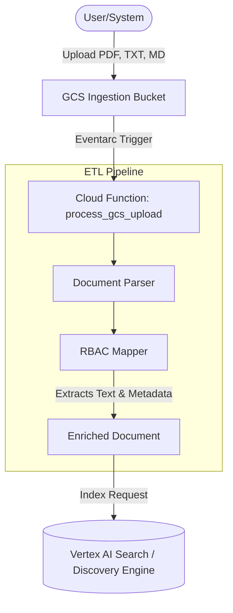

# Data Pipeline: RAG Ingestion & ETL

This directory contains the Python logic for the automated ETL pipeline that powers the RAG solution.

## How it Works


1.  **GCS Trigger**: A user or automated system uploads a document (PDF, TXT, MD) to the designated ingestion bucket.
2.  **Cloud Function**: An Eventarc or Cloud Storage trigger kicks off the `process_gcs_upload` function located in `ingestion/main.py`.
3.  **Parsing & Enrichment**:
    *   **Parser**: Extracts raw text from the document (using `pypdf` for PDFs).
    *   **RBAC Mapping**: Inspects the origin folder path (e.g., `gs://bucket/finance/*.pdf`) and automatically assigns security metadata (e.g., `role: finance`).
4.  **Indexing**: The enriched text and metadata are securely pushed to the **Vertex AI Search (Discovery Engine)** data store, ready for the agent's retrieval turn.

## Directory Structure
- `ingestion/main.py`: The entry point for the Cloud Function.
- `ingestion/parser.py`: The parsing and RBAC mapping logic.
- `requirements.txt`: Python dependencies.
- `schemas/`: Definitions for BigQuery feedback tables and Vertex AI Search metadata.

## RBAC Mapping Rules
The pipeline currently follows these folder-to-role mappings:
- `/finance/` -> `role: finance`
- `/legal/` -> `role: legal`
- `/hr/` -> `role: hr`
- `/private/` -> `role: internal`
- All others -> `role: public`

## Deployment
The pipeline is deployed as a **Google Cloud Function (2nd Gen)**.

### Local Deployment Script (Example)
```bash
gcloud functions deploy rag-ingestion 
    --gen2 
    --runtime=python311 
    --region=us-central1 
    --source=./data-pipeline/ingestion 
    --entry-point=process_gcs_upload 
    --trigger-event-filters="type=google.cloud.storage.object.v1.finalized" 
    --trigger-event-filters="bucket=YOUR_INGESTION_BUCKET" 
    --set-env-vars GOOGLE_CLOUD_PROJECT=YOUR_PROJECT_ID,DATA_STORE_ID=rag-docs
```

## Running Tests
Run the ETL unit tests from the root:
```bash
pytest data-pipeline/tests/
```
