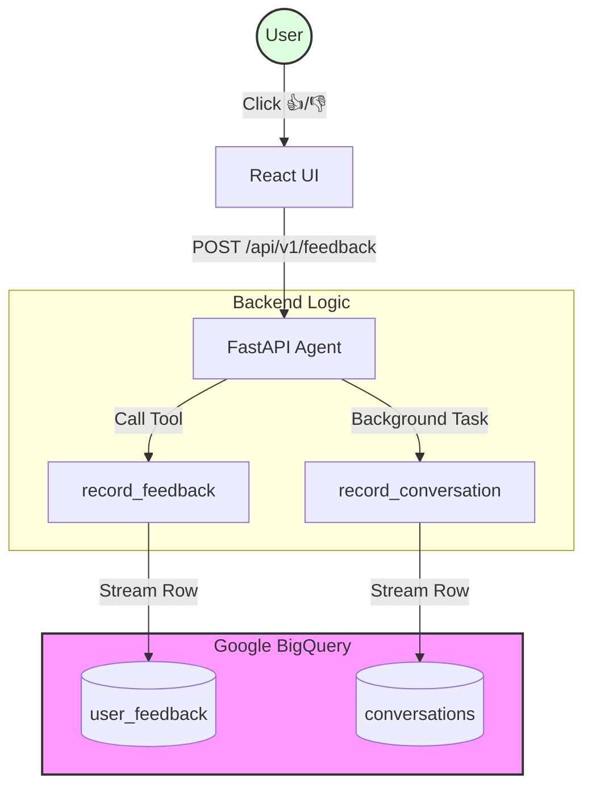

# Testing the Feedback Loop & Analytics

The JIT Two-Stage Retrieval Agent includes a built-in feedback loop that captures user sentiment and full conversation traces for continuous improvement and reranker fine-tuning.

## Data Flow Architecture



1.  **User Interaction**: The user clicks 👍 or 👎 in the web UI.
2.  **API Call**: The frontend sends a `POST` request to `/api/v1/feedback`.
3.  **BigQuery Storage**: The backend agent calls the `record_feedback` tool, which streams the data into the `agent_feedback.user_feedback` BigQuery table.
4.  **Full Trace**: Simultaneously, every full conversation is automatically logged to the `agent_feedback.conversations` table via a background task.

---

## How to Test the Loop

### 1. Verification via UI
1.  Navigate to the chatbot UI.
2.  Ask any question (e.g., "What is the 2025 global outlook?").
3.  Once the response is received, look for the thumbs-up/down icons below the message.
4.  Click **Thumbs Up** 👍.
5.  Open the **Network Tab** in your browser's Developer Tools and verify that a request to `/api/v1/feedback` returned a `200 OK`.

### 2. Verification via BigQuery Console
1.  Go to the [BigQuery Console](https://console.cloud.google.com/bigquery).
2.  Navigate to your project (`jit-tsr-rag-stage`).
3.  Expand the `agent_feedback` dataset.
4.  **Check Feedback**:
    *   Select the `user_feedback` table.
    *   Click the **Preview** tab.
    *   You should see your rating, message ID, and your email address.
5.  **Check Conversations**:
    *   Select the `conversations` table.
    *   Click **Preview**.
    *   You should see the full text of your query and the agent's response.

### 3. Manual Testing via CLI (Optional)
You can simulate feedback without the UI using `curl`:

```bash
# Replace with your actual LB URL and a test message ID
curl -X POST https://rag-stage.example.com/api/v1/feedback 
  -H "Content-Type: application/json" 
  -d '{
    "messageId": "test-123",
    "rating": "up",
    "comment": "Great answer!"
  }'
```

---

## Schema Reference

### `user_feedback` Table
| Field | Type | Description |
| :--- | :--- | :--- |
| `message_id` | STRING | Unique ID of the response. |
| `rating` | STRING | 'up' or 'down'. |
| `user_email` | STRING | Identity of the reviewer. |
| `comment` | STRING | Optional user text feedback. |
| `timestamp` | TIMESTAMP | Time of feedback. |

### `conversations` Table
| Field | Type | Description |
| :--- | :--- | :--- |
| `query` | STRING | The user's input. |
| `response` | STRING | The agent's grounded output. |
| `user_email` | STRING | The authenticated user. |
| `metadata` | STRING | JSON string of retrieval stats. |
| `timestamp` | TIMESTAMP | Time of conversation. |
